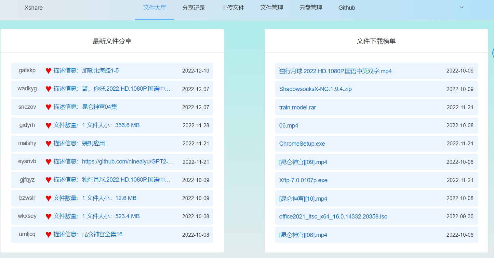
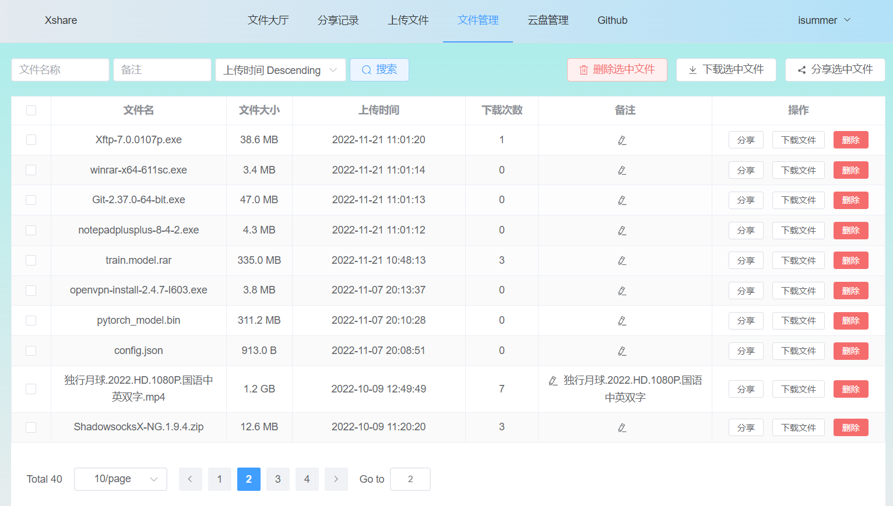
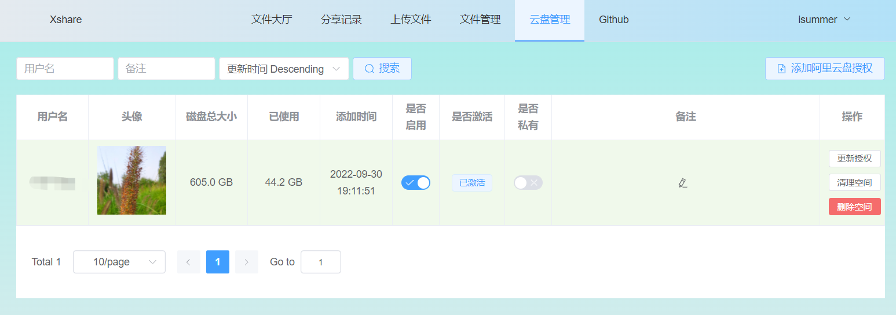
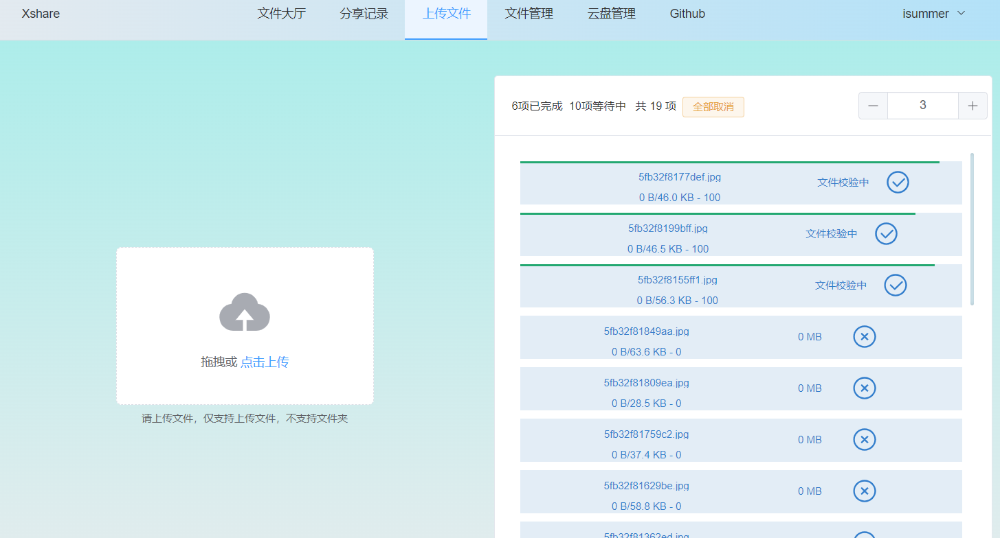

# xshare
###### 基于阿里云盘的文件分享平台


部署环境系统使用centos8stream
### 1.docker 部署 [建议]

##### 从git上面下载源码
```
cd /data/
git clone https://github.com/nineaiyu/xshare
```

#### docker环境安装 [centos8]
```
cd /data/xshare/docker/init
sh init.sh
```
#### 域名准备
- 域名： xshare.hehelucky.cn
- 证书（nginx）[可选，参考文档末尾说明]

#### 配置域名和证书
```shell script
nginx.conf.d/xshare.conf
```


##### client配置文件 vue.config.js
```javascript
const pro_base_env = {
    baseUrl: '/',       //该选项可以填写web-api的域名，类似 https://api.xxx.com/
    static: '/',  //若配置静态文件cdn加速，可以填写cdn加速域名
    version: version,
};
```

#####  构建静态资源和api服务
```
cd /data/xshare/docker/scripts
sh build.sh
```
##### 构建镜像的同时，下载依赖镜像
```shell
docker pull 'bitnami/mariadb:10.7.3'
docker pull 'bitnami/redis:6.2.7'
docker pull 'nginx:1.21.3'
```

#####  启动所有服务
```
cd /data/xshare/docker/scripts
sh start_all.sh
```

#####  关闭所有服务
```
cd /data/xshare/docker/scripts
sh stop_all.sh
```

##### 根据提示创建默认管理用户,主要用与添加默认阿里云盘存储，并设置为公有，这样其他人才可以进行文件上传分享
```shell
docker exec -it xshare python manage.py createsuperuser
```

端口80和443，浏览器输入配置的域名即可访问或者服务器的ip直接访问

### 2.本地部署
#### 构建前端页面
##### 安装构建环境node,需要nodejs 1.16,centos8默认是1.10，需要重置模块，更换1.16版本
```shell
dnf module reset nodejs -y
dnf module enable nodejs:16-epel -y
dnf install nodejs -y
npm install -g yarn
```

##### 开始构建前端web页面
```shell
cd client
yarn install
yarn build
```
构建成功的文件位于```dist```目录下，该目录下为前端页面，拷贝到相应前端目录

#### 部署服务器
##### 安装依赖环境,服务端需要python39环境,并创建python虚拟环境
```shell
dnf install python39 python39-devel mariadb-devel -y
python3.9 -m venv py39
source py39/bin/activate
```

##### 安装依赖,进入server目录
```shell
pip install -U setuptools pip
pip install -r requirements.txt
```

##### 创建数据库,并迁移数据【安装服务可选】
```shell
dnf install mariadb-server -y
```
```mariadb
create database xshare default character set utf8 COLLATE utf8_general_ci;
grant all on xshare.* to xshare@'127.0.0.1' identified by 'KGzKjZpWBp4R4RSa';
```
根据mariadb修改相应的配置
```python
DATABASES = {
    'default': {
        'ENGINE': 'django.db.backends.mysql',
        'NAME': 'xshare',
        'USER': 'xshare',
        'PASSWORD': 'KGzKjZpWBp4R4RSa',
        'HOST': 'mariadb',
        'PORT': 3306,
        'CONN_MAX_AGE': 600,
        # 设置MySQL的驱动
        # 'OPTIONS': {'init_command': 'SET storage_engine=INNODB'},
        'OPTIONS': {'init_command': 'SET sql_mode="STRICT_TRANS_TABLES"', 'charset': 'utf8mb4'}
    },
}
```

##### redis配置【安装服务可选】
```shell
dnf install redis -y
```
根据redis修改相应的配置文件
```python
CACHES = {
    "default": {
        "BACKEND": "django_redis.cache.RedisCache",
        "LOCATION": "redis://%s:%s/1" % ('redis', 6379),
        "OPTIONS": {
            "CLIENT_CLASS": "django_redis.client.DefaultClient",
            "CONNECTION_POOL_KWARGS": {"max_connections": 100},
            "PASSWORD": 'nineven',
            "DECODE_RESPONSES": True
        },
        "TIMEOUT": 60 * 15
    },
}
```


##### 迁移数据库，并启动
```shell
python manage.py makemigrations
python manage.py migrate

# -u nginx 指需要启动的用户，需要有nginx用户，或者其他用户也行
python manage.py start all -u nginx 
```


### 域名SSL支持
- 证书可以从阿里云或者腾讯云申请，每次可免费申请一年
- 还可以使用免费的letsencrypt证书

#### 使用免费的letsencrypt证书，通过acme.sh申请免费证书，该证书有效期3个月，支持自动续订到期时间
###### 启动acme容器，用与申请证书和自动续订
```shell
cd docker/acme
docker compose up -d
```
需要其他准备好 一个邮箱和域名

下面操作，需要将域名[xshare.hehelucky.cn] 替换为自己的域名，邮箱[nineven@qq.com] 替换为自己的邮箱


```shell
# 首次操作需要通过邮箱[nineven@qq.com]注册一个临时授权，并且邮箱可以收到证书到期提醒
docker exec acme --register-account -m nineven@qq.com

# 申请域名[xshare.hehelucky.cn]证书
docker exec acme --issue -d xshare.hehelucky.cn --webroot /data/web/

# 将申请好的证书拷贝到NGINX配置目录，进行配置
docker exec acme --install-cert -d xshare.hehelucky.cn --key-file /etc/nginx/conf.d/xshare.hehelucky.cn.key --fullchain-file /etc/nginx/conf.d/xshare.hehelucky.cn.pem
```

#### 配置SSL证书
```shell
vim docker/nginx/nginx.conf.d/xshare.conf
```
增加下面ssl支持配置
```shell
     listen 443 ssl http2;
     ssl_certificate        /etc/nginx/conf.d/xshare.hehelucky.cn.pem;
     ssl_certificate_key    /etc/nginx/conf.d/xshare.hehelucky.cn.key;
     ssl_protocols TLSv1.1 TLSv1.2 TLSv1.3;
     ssl_ciphers EECDH+CHACHA20:EECDH+CHACHA20-draft:EECDH+AES128:RSA+AES128:EECDH+AES256:RSA+AES256:EECDH+3DES:RSA+3DES:!MD5;
     ssl_prefer_server_ciphers on;
     ssl_session_cache shared:SSL:10m;
     ssl_session_timeout 10m;
     add_header Strict-Transport-Security "max-age=31536000";
```
重新nginx容器
```shell
cd docker/nginx
docker compose down
docker compose up -d
```
****
[Demo访问](https://xshare.heheshow.cn/)

功能预览：



